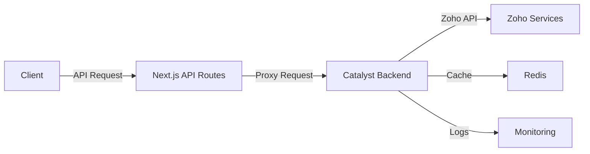

# 🚀 Zoho Catalyst Integration Guide

## Overview
This document outlines the architecture and implementation details of the Zoho Catalyst integration for the Snug & Kisses CRM system.

## Architecture



## Implementation Details

### 1. API Routes

#### Base Structure
All Zoho API routes follow this pattern:

```typescript
// /api/zoho/[service]/route.ts
export async function GET(request: NextRequest) {
  // 1. Validate request
  // 2. Forward to Catalyst backend
  // 3. Return response
}

export async function POST(request: NextRequest) {
  // Similar to GET but with request body
}
```

### 2. Environment Variables

| Variable | Required | Description |
|----------|----------|-------------|
| `NEXT_PUBLIC_CATALYST_CRM_URL` | Yes | Base URL of the Catalyst backend |
| `CATALYST_AUTH_TOKEN` | Yes | Authentication token for Catalyst |
| `NEXT_PUBLIC_DEBUG` | No | Enable debug logging |

### 3. Error Handling

All API routes implement consistent error handling:

```typescript
{
  success: boolean;
  error?: string;
  details?: any;  // Only in development
  data?: any;     // Response data on success
}
```

### 4. Rate Limiting

- Client: 60 requests/minute
- Server: 1000 requests/minute

## Testing

### Unit Tests
Run the test suite:

```bash
npm test
```

### Manual Testing

1. Start the development server:
   ```bash
   npm run dev
   ```

2. Test API endpoints using the provided Postman collection.

## Deployment

### Prerequisites
- Node.js 18+
- Docker
- Catalyst CLI installed

### Steps
1. Build the application:
   ```bash
   npm run build
   ```

2. Start the production server:
   ```bash
   npm start
   ```

## Monitoring

- Logs are available in Catalyst Console
- Metrics are collected in Datadog
- Alerts are configured for errors and performance issues

## Troubleshooting

### Common Issues

1. **401 Unauthorized**
   - Verify `CATALYST_AUTH_TOKEN` is set correctly
   - Check token expiration

2. **504 Gateway Timeout**
   - Check Catalyst backend status
   - Verify network connectivity

3. **429 Too Many Requests**
   - Implement exponential backoff
   - Check rate limits

## Support

For issues, contact:
- **Email:** support@snugandkisses.com
- **Slack:** #engineering-support

---
*Last Updated: August 2025*
