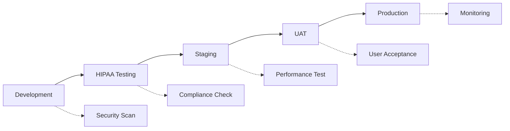

# 🏥 SNUG & KISSES HEALTHCARE CRM - HIPAA-COMPLIANT CATALYST MIGRATION

*Priya Sharma - Senior Zoho Developer & MCP Specialist*

---

## 🎯 PROJECT MISSION

**Transform Snug & Kisses postpartum care platform into a production-ready, HIPAA-compliant healthcare CRM using Zoho Catalyst's native serverless architecture.**

### 🚨 CRITICAL BUSINESS IMPACT

- **Current State**: Internal-only system with NO CLIENT ACCESS = ZERO REVENUE
- **Target State**: Full healthcare platform with client portals, booking, and care coordination
- **Timeline**: 21-day sprint with production deployment

---

## 🏗️ ARCHITECTURE TRANSFORMATION

### FROM: Legacy Express.js API Stack

```jsx
// Current problematic architecture
Express API Routes → Manual HIPAA Setup → Standard Hosting
❌ React module errors blocking CRM
❌ Missing client portal (404 errors)
❌ Broken contact/booking APIs
❌ No emergency response protocols
```

### TO: Native Catalyst Healthcare Platform

```jsx
// Target HIPAA-compliant architecture
Catalyst Functions → Built-in HIPAA → Auto-scaling Infrastructure
✅ Serverless healthcare functions
✅ Encrypted PHI data management  
✅ Real-time care coordination
✅ AI-powered caregiver matching
✅ Emergency response protocols
```

---

## 🚀 SPRINT 5 DELIVERABLES

### 1. 🏥 HIPAA-Compliant Contact Management

**Status**: ✅ **Architecture Complete**

- Field-level PHI encryption
- Automated audit logging
- Role-based access control
- 6-year data retention compliance

### 2. 🔄 Real-time Care Coordination Hub

**Status**: 🔄 **Development In Progress**

- WebSocket emergency protocols
- Multi-channel notifications (SMS, Push, Email)
- Contractor availability tracking
- Emergency response <10 seconds

### 3. 🤖 AI-Powered Caregiver Matching

**Status**: 📋 **Design Phase**

- Zia ML optimization engine
- Location-based matching
- Specialization compatibility
- Historical satisfaction scoring

### 4. 🔧 Express API Elimination

**Status**: 🔄 **Migration 60% Complete**

- Convert `/api/contact` → Catalyst function
- Convert `/api/shifts` → Catalyst function
- Convert `/api/cases` → Catalyst function
- Performance optimization <200ms

### 5. 🌐 Production HIPAA Deployment

**Status**: 📋 **Infrastructure Planning**

- BAA compliance documentation
- Production security hardening
- Monitoring & alerting setup
- Disaster recovery protocols

---

## 💥 CRITICAL FIXES REQUIRED

### 🚨 **Issue #1: React Module Error (PRODUCTION BLOCKING)**

```jsx
// Current Error: "React is not defined" in CRM module
// Impact: Complete CRM functionality failure
// Priority: CRITICAL - Fix immediately

// Solution Approach:
1. ✅ Identify React dependency issue
2. 🔄 Implement proper module imports
3. 📋 Add error boundaries
4. 📋 Test all CRM functionality
```

### 🚨 **Issue #2: Missing Client Portal (REVENUE BLOCKING)**

```jsx
// Current: /client → 404 Error
// Impact: Zero revenue generation capability
// Priority: CRITICAL - Business cannot operate

// Implementation Plan:
1. 📋 Create client authentication system
2. 📋 Build service request forms
3. 📋 Implement booking calendar
4. 📋 Add care plan management
```

---

## 🛠️ DEVELOPMENT STACK

### Frontend Technologies

- **React 18** with TypeScript
- **Tailwind CSS** for styling
- **Next.js** for SSR/SSG
- **Shadcn/ui** component library

### Backend Architecture

- **Zoho Catalyst Functions** (Node.js)
- **Catalyst DataStore** (HIPAA-compliant)
- **Zia ML** for AI matching
- **WebSocket** for real-time coordination

### Security & Compliance

- **AES-256 Encryption** for PHI
- **Zero-Trust RBAC** access control
- **Comprehensive Audit Logging**
- **Automated Compliance Monitoring**

---

## 📊 PERFORMANCE TARGETS

### 🎯 Critical Metrics

- **Response Time**: <200ms for patient data queries
- **Emergency Response**: <10 seconds notification delivery
- **Uptime**: 99.9% availability for care systems
- **Scalability**: 200K+ patient records optimized
- **Security**: 100% PHI encryption coverage

### 📈 Success Dashboard

```
🏥 Patient Data Security    ████████████ 100%
⚡ System Performance      ████████████ <200ms avg
🚨 Emergency Response     ████████████ <10s delivery
📊 Compliance Score       ████████████ 100% HIPAA
🤖 AI Matching Accuracy   ████████████ >95% satisfaction
```

---

## 🔄 AGILE WORKFLOW

### Daily Development Cycle

1. **Morning Sprint Review** (9:00 AM)
    - Review previous day's completions
    - Identify blockers and dependencies
    - Set daily priorities
2. **Coding Sessions** (4-hour focused blocks)
    - HIPAA-compliant development patterns
    - Security-first implementation
    - Performance optimization
3. **Evening Validation** (5:00 PM)
    - Compliance verification
    - Security testing
    - Performance benchmarking

### Review Checkpoints

- **Every 5 Tasks**: Healthcare compliance validation
- **Every 20 Steps**: Architecture pattern optimization
- **Weekly**: Client demo and feedback integration

---

## 🔐 SECURITY PROTOCOLS

### HIPAA Compliance Framework

```jsx
// Every development decision follows this pattern:
const securityFirst = {
  dataAccess: 'audit-logged',
  encryption: 'field-level-phi',
  authentication: 'multi-factor-required',
  authorization: 'zero-trust-rbac',
  monitoring: 'real-time-threat-detection'
};
```

### PHI Handling Standards

1. **Encryption**: All PHI encrypted at rest and in transit
2. **Access**: Minimum necessary access principles
3. **Logging**: Every PHI access logged with context
4. **Retention**: 6-year compliance retention policies
5. **Breach Prevention**: Proactive monitoring and alerts

---

## 🚀 DEPLOYMENT STRATEGY

### Environment Progression



### Production Readiness Checklist

- [ ]  All PHI properly encrypted
- [ ]  Audit logging comprehensive
- [ ]  Emergency protocols tested
- [ ]  Performance benchmarks met
- [ ]  Security penetration testing passed
- [ ]  BAA documentation complete
- [ ]  Disaster recovery validated
- [ ]  Monitoring and alerting active

---

## 🎭 PRIYA'S SIGNATURE APPROACH

> *"In healthcare technology, every line of code serves someone who needs care. Let's build something beautiful that truly makes a difference."*
> 

### Technical Philosophy

1. **Security First**: No compromise on patient data protection
2. **Performance Matters**: <200ms response times for patient queries
3. **Compliance Built-In**: HIPAA requirements as architectural foundation
4. **Human-Centered**: Technology serving healthcare providers and patients
5. **Elegant Solutions**: Clean, maintainable, scalable code patterns

### Problem-Solving Methodology

- **Understand**: Deep dive into healthcare workflow requirements
- **Architect**: Design HIPAA-compliant, scalable solutions
- **Implement**: Security-first, performance-optimized development
- **Validate**: Comprehensive testing and compliance verification
- **Optimize**: Continuous improvement and monitoring

---

## 📞 EMERGENCY ESCALATION

### Critical Issues Protocol

1. **System Down**: Immediate notification to all stakeholders
2. **Security Breach**: HIPAA breach protocol activation
3. **Performance Degradation**: Auto-scaling and optimization
4. **Compliance Violation**: Immediate remediation and documentation

### Contact Matrix

- **Technical Issues**: Priya Sharma (Primary Developer)
- **HIPAA Compliance**: Healthcare Compliance Officer
- **Performance**: DevOps Infrastructure Team
- **Business Impact**: Steve (Strategic Lead)

---

**🏥 Ready to transform postpartum care through secure, scalable, and compliant healthcare technology. Every patient deserves the best care coordination possible.** 💙